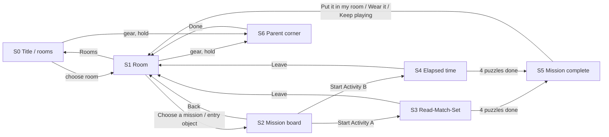
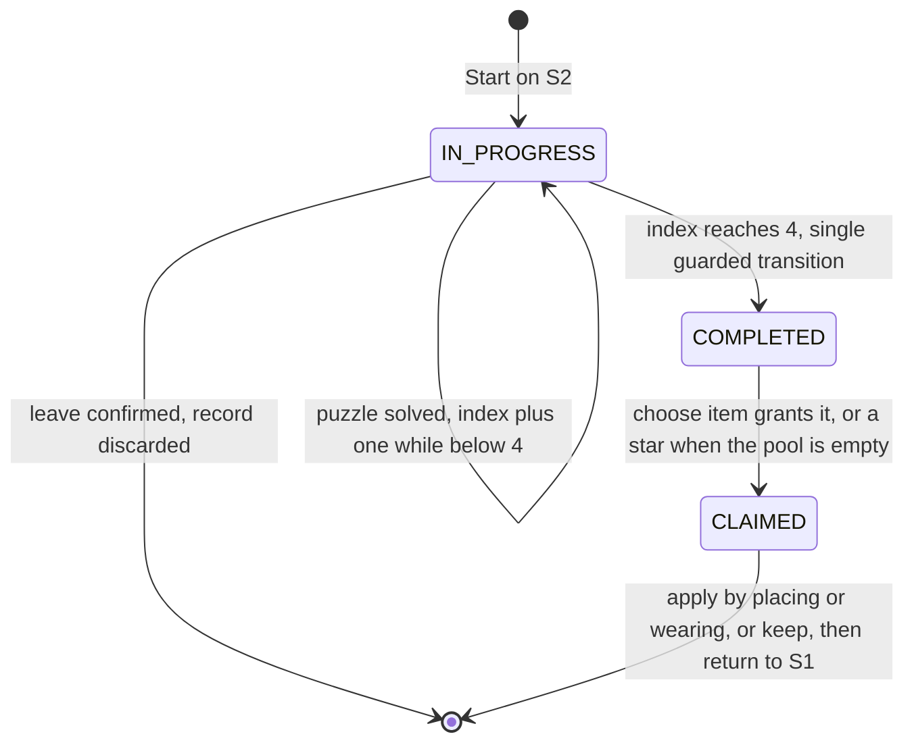

# My Cosmic Room — Specification

Status: specification draft for the first release, derived from [PRD.md](PRD.md) and the approved concept images in [concepts/README.md](concepts/README.md). Date: 12 September 2026. Working title: My Cosmic Room (provisional, see decision D9).

This document is the input for the implementation session. It contains no code and no implementation was started while writing it.

## 0. How to read this document

Every requirement carries one of three tags:

- **[C]** Confirmed: stated by the user in the PRD's "Confirmed by the user" list. Do not change without asking.
- **[P]** Proposed: a default chosen in this specification with a stated rationale. Implement as written unless the user overrides it. All ten open decisions from PRD §10 are resolved as **[P]** in §1.
- **[D]** Deferred: explicitly out of the first release. Do not build; keep the data model open for it where cheap.

Terms used throughout:

- **Theme**: Space Playroom or Sweet Playroom. **Room**: the home screen of a theme.
- **Activity A** = read, match and set the clock. Space presentation: *Rocket launch*. Sweet presentation: *Tea-party time*.
- **Activity B** = elapsed time. Space presentation: *Space delivery*. Sweet presentation: *Toy delivery*.
- **Mission**: one play-through of one activity in one theme, four puzzles long, ending in one reward.
- **Time value**: minutes since midnight, integer 0–1439. All time maths in the game uses this representation.
- **Stage**: the logical 1536×1024 drawing area (3:2, the concept aspect ratio) that scales uniformly to the browser window.

## 1. Decision register

Each row resolves one open decision from PRD §10. "If overridden" says what else in this document changes.

| # | Decision | Resolution [P] | Rationale | If overridden |
| --- | --- | --- | --- | --- |
| D1 | Language | All text lives in a string table with English, Turkish and Dutch. Dutch as an option is confirmed [C] (requested 12 September 2026); the mechanism is proposed. The first launch shows a language choice (English / Türkçe / Nederlands); it can be changed in the Parent corner. No default language is assumed. Spec text and identifiers are English. | The discussion started in Turkish, the approved concepts are English, and Dutch was requested by the user. The full game has roughly 150 short strings, so each extra language costs little. A first-launch choice avoids guessing the child's language. | If fewer languages are wanted, delete the corresponding columns of §14 and buttons in §3.3. Nothing else changes. |
| D2 | Difficulty | Two independent selectors: Reading level R1–R4 (whole hours, half hours, quarter hours, five minutes) and Elapsed level E1–E3 (whole-hour gaps, short quarter-hour gaps, long journeys). Defaults R2 and E1. Levels are chosen on the mission board by the child, or locked by the parent. Progression is a gentle suggestion, never a gate. One-minute reading is deferred. | Matches PRD §4 table and "start with half-hours; full hours remain a warm-up". Separate selectors let a child be strong at reading and new to elapsed time. | If a single combined level is wanted, map R and E to one index in §7.1 and show one chip row. |
| D3 | Rewards | Preview the two next prizes before the mission; choose one after completing it. Prize order is fixed and visible (collection order), one decoration and one dress-up item per pair. 12 earnable items per theme in two collections of 6. When a theme's inventory is complete, missions award a star on the room's star chart (capped at 24 stars). | Follows the PRD's proposed resolution and the approved reward concept. Fixed order keeps prizes predictable. Stars keep late missions meaningful without inventing more art. | Fewer items: drop collection 2 in §11.2; the counters and pairing rules already handle any count. Choosing before the mission: move the choice UI from §3.6 to §3.3 and name the item in mission text. |
| D4 | Room interaction | Fixed placement slots, no free dragging. Each room has seven slots typed BED, RUG, LAMP, WALL, SHELF, HANGING, NOOK; every slot always holds exactly one item; placing a decoration swaps it with the current occupant, which returns to inventory. Every placed item has a generic tap reaction; three objects per room plus the companion have special reactions. | Slots are keyboard-accessible, need no collision or layering logic, and guarantee the room always looks complete. Bounded reactions keep art and animation cost known. | Constrained dragging would add a drag layer, per-item footprints and z-ordering rules to §4.2; the save format's `slots` map would become a list of positioned items. |
| D5 | Character | One shared heroine in both rooms with four wardrobe slots: Hair, Outfit (one-piece top+bottom), Shoes, Extra (accessory, may be empty). Hair is included at launch with three styles. Starter wardrobe: 3 outfits, 2 shoes, 3 hair, 0 extras. Clothing is shared across rooms; decorations are theme-bound. | The concept shows Clothes / Hair / Shoes tabs. A combined outfit halves the layering and art count. Clothes travelling with the child between rooms feels natural and makes every earned garment usable everywhere. | Remove Hair from §4.4 and the Hair tab if cut; hair assets are three files. Theme-bound clothing would add a theme filter to the wardrobe and change §5.3. |
| D6 | Persistence | Single local profile in `localStorage`, versioned JSON, autosaved after every state change. A backup copy of the last good save is kept; if the main save fails to parse, the backup is restored. Parent corner offers Export (download JSON), Import, and Reset with a hold-to-confirm. | Local-only is what the PRD recommends; export/import gives a manual way to move to another computer without accounts. | Cloud sync would add an account layer; the save schema in §11.3 is designed to be uploaded as-is. |
| D7 | Audio and access | Sound effects (about ten short clips) with a persisted mute toggle; no music and no recorded narration at launch. Full keyboard operation. Reduced motion honoured from the OS setting with an in-app override. Target: current desktop Chrome, Edge, Firefox and Safari on macOS/Windows, window at least 1024×640, mouse plus keyboard; touch works but is not tuned. | Effects are cheap and rewarding; narration in two languages is a recording project and the child reads. Keyboard alternatives satisfy "precise dragging is not the only input". | Narration: add an audio key per string in §14 and a speaker button on question screens. |
| D8 | Two-theme behaviour | Both rooms are open from the first launch. Switching is instant from the room screen. Per-theme: room layout, earned decorations, collection counter, star chart. Shared: heroine and wardrobe, levels, statistics, settings. Missions cannot be switched mid-way; leaving a mission discards it. Sweet mission names: *Tea-party time* (Activity A) and *Toy delivery* (Activity B). Sweet mission entry object: a toy letterbox on the shelf. | Follows PRD §6 proposed switching behaviour. The letterbox fits both an invitation (tea party) and a parcel (delivery). | Different sweet names change only the string table and the two illustrations named in §15. |
| D9 | Product name | Keep "My Cosmic Room" as the app title constant until the user picks an umbrella name. Candidates for the user: *Tick-Tock Playrooms* (TR: *Tik Tak Oyun Odaları*), *My Little Playrooms* (TR: *Küçük Oyun Odalarım*), *Clock Club* (TR: *Saat Kulübü*). The room names *Space Playroom* and *Sweet Playroom* are used everywhere in the UI. | The title is a single string and one logo asset; nothing structural depends on it. | Change the `app.title` string and the logo. |
| D10 | Implementation and delivery | TypeScript, Vite, Preact for UI, SVG for clocks, CSS for layout and animation, no backend. Vitest for logic, Playwright for a few end-to-end flows. Static hosting on GitHub Pages or Cloudflare Pages; no domain required. Art: placeholder shapes first, then assets generated through Codex CLI (`codex exec`) with two model presets chosen by asset complexity, sol-med for low-complexity assets and astra-light for high-complexity ones (§15.6), background-removed, exported as PNG at 2× plus SVG where practical. | A small component framework keeps state → UI predictable; SVG gives exact clock geometry; static hosting matches "no accounts, no backend". | Vanilla TypeScript is acceptable if Preact is unwanted; §16 module boundaries do not depend on the framework. |

Additional decisions made in this document that were not listed in the PRD:

| # | Decision | Resolution [P] |
| --- | --- | --- |
| D11 | Digital time format in Activity A | 12-hour digits without a period label ("3:30") at every reading level by default, so the analog face and the digital answer agree without implying a 24-hour reading. A Parent-corner toggle "24-hour digital clocks in reading puzzles" switches Activity A to "15:30" and adds a sun/moon day-period badge to every analog face. Activity B always uses 24-hour digits. |
| D12 | Hint timeline geometry | The jump timeline is an explicit sequence of jumps with equal spacing between points, not a proportional scale. Labels therefore never collide and always sit under their own point. |
| D13 | Advancing after a correct answer | A large "Next" button (auto-focused) advances; there is no auto-advance timer. The child controls pacing. |
| D14 | Mission composition | Activity A missions contain exactly two READ, one MATCH and one SET puzzle, shuffled, with SET never first. Activity B missions contain four elapsed-time puzzles. All four puzzles in a mission use the mission's level; puzzles never repeat a target within the mission and avoid the last eight targets seen across missions. |
| D15 | Companions | Space companion: a turquoise alien, placeholder name *Pip*. Sweet companion: a grey-and-white cat, placeholder name *Mimi*. Names are strings and can be changed. |
| D16 | Asset generation tooling | Codex CLI is the generation tool [C, requested 12 September 2026]. Two model presets are used, chosen per asset by the complexity rubric in §15.6: **astra-light** for high-complexity assets and **sol-med** for low-complexity assets [C: the user confirmed that astra is the more capable model, so it takes the harder assets even at light effort, while sol at medium effort is enough for simple single objects]. The rubric that classifies assets is [P]. The exact model identifiers behind the two preset names are verified against the installed Codex CLI in M0 (only `gpt-6-astra` is configured locally today; effort levels minimal to xhigh exist). |

Decisions the user should confirm in the next session, in priority order: D1 (language), D3 (inventory size and reward timing), D4 (slots instead of dragging), D5 (shared wardrobe, hair at launch), D11 (12-hour reading digits), D9 (title). Everything else can be changed later without rework.

## 2. Scope of the first release

Included [C unless marked]:

- Two complete themed playrooms with their own art, starter furniture, companion, decorations and mission presentation.
- One shared heroine with a usable wardrobe in both rooms.
- Activity A (read, match, set) and Activity B (elapsed time) in both themes, at all levels R1–R4 and E1–E3 [P for R4 five-minute reading being included; PRD left it open].
- Four-puzzle missions, optional hints, no timers, no lives, no penalties [P, PRD proposed defaults].
- Predictable rewards: 12 earnable items per theme [P], usable and never consumed.
- Local save with export, import and reset [P].
- English, Turkish and Dutch text. Dutch as an option is [C]; the string-table mechanism and first-launch choice are [P].
- Keyboard operation and reduced-motion support [P].

Deferred [D]: one-minute reading, midnight-spanning intervals, calendar arithmetic, free-form room building, alien café, planet navigation, party mini-games, narration, music, accounts, cloud sync, analytics, multiplayer, sharing, purchases, mobile-specific layout.

## 3. Screens and flows

### 3.1 Screen list

| Id | Screen | Purpose | Reachable from |
| --- | --- | --- | --- |
| S0 | Title and room choice | App title, two room cards, language switch, parent gear. On the very first launch a language choice overlay appears first. | App start, "Rooms" button on S1 |
| S1 | Room (home) | The playable room of the current theme. Hosts Decorate mode and the Dress-up panel. Mission entry. | S0, S6 (return), S5 |
| S2 | Mission board | Pick Activity A or B for the current theme, see and change levels, see the two prizes waiting, start. | S1 |
| S3 | Activity A puzzle screen | READ, MATCH and SET puzzles with the theme's story frame. | S2 |
| S4 | Activity B puzzle screen | Elapsed-time puzzles with the theme's story frame and the jump hint. | S2 |
| S5 | Mission complete and prize choice | Celebration, choice of one prize, apply or keep. | S3/S4 after puzzle 4 |
| S6 | Parent corner | Language, levels and lock, 24-hour toggle, sound, motion, save management. Adult gate: press and hold 1.5 s. | Gear icon on S0 and S1 |

Overlays (not screens): Confirm-leave-mission dialog; progression suggestion dialog; "new item" badge in the wardrobe/decoration panel.

### 3.2 Flow diagram



Core loop (PRD §3): choose a room → room and wardrobe → choose a mission and see its prizes → solve four puzzles with optional help → choose one prize → place or wear it → free play or another mission.

### 3.3 S0 Title and room choice

- Layout: title lockup top centre; two large room cards side by side (Space Playroom left, Sweet Playroom right), each a painted thumbnail of that room with the heroine in her current outfit and the room name; small language switch (EN / TR / NL) bottom left; gear icon bottom right; sound toggle bottom right next to the gear.
- The last-used room card is pre-focused. Enter or click opens S1 for that theme.
- First launch only: an overlay with three big buttons, "English", "Türkçe" and "Nederlands", shown before anything else. The chosen language is saved. The overlay never returns; the switch on S0 and S6 changes language later.
- No loading splash beyond a short fade; the app must be interactive within 2 s on a normal connection after the first load (assets for the chosen room may stream in behind a skeleton).

### 3.4 S1 Room

Reference: [01-room-and-wardrobe.png](concepts/01-room-and-wardrobe.png) for Space, [early-playroom.png](concepts/early-playroom.png) for Sweet.

Fixed elements, same positions in both themes:

- Top left: room name badge ("Space Playroom" / "Sweet Playroom") and a "Rooms" door button that returns to S0.
- Top right: collection counter "n / 12 collected" for this theme with a star icon; sound toggle; gear icon (parent corner, press and hold).
- Bottom centre: two large buttons "Decorate" and "Dress up".
- Near the mission entry object: a "Choose a mission" button with a rocket (Space) or envelope (Sweet) icon. The entry object itself (toy rocket / toy letterbox) is also clickable and opens S2.
- Right side: a slide-in panel used by Decorate mode and Dress-up mode (§4). Width 440 stage px; the room remains visible and scaled to the left of it.
- Scene: the painted room background, seven decoration slots (§4.1), the heroine standing centre-left, the companion beside her, the star chart (a small poster; §10.5).

Room states:

- **Free play**: clicking a placed decoration triggers its reaction (§4.3); clicking the heroine makes her wave; clicking the companion triggers its reaction. Nothing here can change progress or inventory.
- **Decorate mode**: slots are outlined; the panel lists owned decorations for this theme (§4.2).
- **Dress-up mode**: the panel shows the wardrobe (§4.4); the heroine turns slightly to face the panel.

Returning from S5 with a prize applied: the room opens with the new item already in place or worn, then a short sparkle plays on it (PRD: "Returning to the room should visibly reflect the selected reward").

### 3.5 S2 Mission board

- Two mission cards for the current theme: Activity A card and Activity B card, each with: illustration, mission name (Rocket launch / Space delivery, or Tea-party time / Toy delivery), a one-line description, a row of level chips, a "Start" button.
- Level chips. Activity A: Whole hours · Half hours · Quarter hours · Five minutes (R1–R4). Activity B: Whole hours · Quarters · Long journeys (E1–E3). The current level is highlighted; clicking a chip changes the level for that activity (shared across themes). If the parent has locked levels, the chips are shown but disabled with a small lock icon.
- "Prizes waiting" box: the two next items (§10.2) with names, or "All prizes collected! Missions now earn stars" with the star chart count when the pool is empty.
- "Back to room" button top left.
- Starting a mission creates a mission record (§10.1) and opens S3 or S4 with puzzle 1.

### 3.6 S3 Activity A puzzle screen

Reference: layout convention of [early-space-club.png](concepts/early-space-club.png) and [early-playroom.png](concepts/early-playroom.png) (large clock, three answers, hint button, progress row).

Frame, both themes: a large light panel occupying the centre (about 1000×820 stage px) sits inside the theme's scene. Outside the panel: the heroine (left), the companion (right), a preparation tracker (four steps, see below) and the "Prizes waiting" pair as small icons top right. Nothing outside the panel is interactive except "Leave" (top left, small) and the sound toggle.

Inside the panel, top to bottom:

1. Mission name and story line (e.g., "Rocket launch — Get the rocket ready!").
2. The question line, one sentence (§14 strings `a.read.q`, `a.match.q`, `a.set.q`).
3. The puzzle body:
   - READ: one large analog clock (diameter 440 stage px) showing the target; under it three digital answer buttons.
   - MATCH: one large digital time display; under it three analog clocks (diameter 240 stage px each) as answer buttons, each with a plain letter label A/B/C above it.
   - SET: one large analog clock the child can manipulate, a control strip (§6.4), and a "Check" button.
4. Bottom row: "Hint" button (left), progress "Question k of 4" with four dots (centre), and "Next" (right, appears after a correct answer).

Preparation tracker: four small icons under the panel that light up one per solved puzzle. Space: fuel, hatch, lights, countdown. Sweet: cups, cake, teapot, guests. After the fourth, the story reaction plays (rocket launch animation; tea party begins) before S5.

### 3.7 S4 Activity B puzzle screen

Reference: [02-space-delivery-elapsed-time.png](concepts/02-space-delivery-elapsed-time.png).

Same frame as S3. Inside the panel:

1. Mission name and story line ("Space delivery — Your parcel is on its way!" / "Toy delivery — A parcel is coming to the playroom!").
2. Journey strip: origin icon, dashed path with the vehicle (rocket carrying a parcel / balloon-carried parcel with the cat courier), destination icon. The vehicle advances one quarter of the path per solved puzzle.
3. Question line: "How long is the journey?" / "How long does the delivery take?".
4. Two digital displays labelled "Leaves" and "Arrives" (24-hour, §6.2) with a small vehicle icon between them.
5. Three duration answer buttons (§8.3).
6. Collapsible "Show the jumps" hint (§8.4), collapsed by default, remembers nothing between puzzles.
7. Bottom row identical to S3.

### 3.8 S5 Mission complete and prize choice

Reference: [03-mission-reward.png](concepts/03-mission-reward.png).

- Background: the current room, dimmed, with confetti (skipped under reduced motion).
- Card: "Mission complete!" and "4 clock puzzles solved"; "Choose your prize"; the two candidate items as large selectable tiles with names; the selected tile shows a check mark and a thick outline (not colour alone); an action button whose label depends on the selected item's kind: "Put it in my room" (decoration) or "Wear it" (dress-up); a secondary "Keep playing" button.
- Bottom left: a live room preview thumbnail showing the room with the selected decoration placed in its slot, or the heroine wearing the selected clothing. It updates on selection.
- If only one item remains in the pool, the card shows a single tile and the action button; if the pool is empty, the card shows "You earned a star!" with the star chart and one "Back to my room" button.
- The primary action grants the item, applies it and returns to S1. "Keep playing" grants the item without applying it (it appears in the panel with a "New" badge) and returns to S1. The grant happens once, on entering S5, not on button press (§10.3), so closing the browser here does not lose the prize.

### 3.9 S6 Parent corner

- Gate: the gear icon must be pressed and held for 1.5 s (a ring fills). Keyboard: focus the gear and hold Enter or Space for 1.5 s.
- Sections and controls:
  - Language: English / Türkçe / Nederlands.
  - Levels: Reading level R1–R4 and Elapsed level E1–E3 as radio rows with the same child-facing names plus a short adult description; a "Lock levels (child cannot change them)" switch.
  - Clock options: "24-hour digital clocks in reading puzzles" switch (D11).
  - Sound: on/off. Motion: Follow system / Reduced / Full.
  - Save: "Export save file" (downloads `my-cosmic-room-save.json`), "Import save file" (file picker, validates, then replaces after a confirm), "Reset everything" (hold 2 s, then a typed confirm word is not required; the hold is the confirm).
  - About: version, credits, a note that nothing is collected or sent anywhere.
- "Done" returns to the screen that opened it.

## 4. Room and wardrobe

### 4.1 Decoration slots [P, D4]

Each room defines seven slots. Slot geometry (anchor point, scale, z-order) is data in the theme catalogue and is tuned visually with a debug overlay; no coordinates are fixed in this document.

| Slot | Accepts | Space starter | Sweet starter | May be empty |
| --- | --- | --- | --- | --- |
| BED | beds | Plain blue bed | Plain pink bed | No |
| RUG | rugs | Plain round rug | Plain dotted rug | No |
| LAMP | lamps, on the nightstand | Plain lamp | Plain lamp | No |
| WALL | posters and frames | Rocket poster | Tulip picture | No |
| SHELF | small toys on the shelf | Astronaut figure | Bunny plush | No |
| HANGING | ceiling mobiles and garlands | Paper star string | Bunting | No |
| NOOK | cushions and beanbags on the floor | Purple beanbag | Yellow sofa cushion | No |

Rules:

- Every slot always holds exactly one item; there is no empty state and no remove action. Placing an item into an occupied slot swaps them; the previous occupant goes back to the panel.
- Starter items are ordinary inventory items flagged `starter: true`; they can be placed again later, so a child can return to the plain bed.
- Decorations belong to the theme in which they were earned and only appear in that room's panel (D8).
- The heroine and companion are drawn in front of RUG and behind BED/NOOK; z-order per slot is catalogue data.

### 4.2 Decorate mode

- Enter: "Decorate" button, or press D in the room. Exit: the panel's close button, Escape, or "Decorate" again.
- Panel content: owned decorations for this theme grouped by slot type in the order of the table above, each tile showing the item, its name, and a small label "In room" when currently placed, or "New" if earned and never placed. Tiles are 180×180 stage px, minimum 2 per row.
- Placing with the mouse: click a tile; every slot that accepts it gets a dashed outline and a pulsing marker; click a slot to place. Clicking anywhere else cancels.
- Placing with the keyboard: arrow keys move between tiles; Enter on a tile places it into the first compatible slot (the only compatible slot for the current catalogue, since each slot type has exactly one slot). Space opens the same highlighted-slot state for confirmation if more than one slot is compatible in a future catalogue.
- Feedback: the item pops into place with a short scale animation and a soft "place" sound; the swapped-out item's tile in the panel loses its "In room" label.
- Preview: hovering or focusing a tile shows a faint ghost of the item in its slot for as long as the tile is hovered/focused (PRD: "useful preview and clear selection state").

### 4.3 Item reactions [P, D4]

- Generic reaction for every placed decoration: a 400 ms bob with a sparkle and a soft pop sound. Works in free play only, never inside missions.
- Special reactions, three per room, replacing the generic reaction for those slots:
  - Space: LAMP toggles the room between day and evening lighting (a tinted overlay); BED makes Pip jump onto the bed and bounce twice; the toy rocket wobbles, puffs smoke and its window lights up.
  - Sweet: LAMP toggles lighting the same way; BED makes Mimi curl up on the bed; the toy letterbox flips its flag and a tiny envelope pops out and back.
- Heroine: waves and blinks. Companion: Pip spins and giggles; Mimi purrs and stretches.
- Reactions are purely visual and never write to the save, except LAMP lighting state, which is saved per theme.

### 4.4 Wardrobe and heroine [P, D5]

Slots: Hair, Outfit, Shoes, Extra.

| Slot | Starter choices (shared) | Earned examples | Empty allowed |
| --- | --- | --- | --- |
| Hair | Two buns (default), high ponytail, loose with clip | none in the first release | No |
| Outfit | Lilac planet tee with mint skirt (default), floral sweater with pinafore, star hoodie with trousers | Cloud pyjamas, colourful spacesuit, floral pyjamas, strawberry dress | No |
| Shoes | Yellow socks with white sneakers (default), pink mary-janes | Bunny slippers, space boots, cat slippers, rainbow sandals | No |
| Extra | none | Star hair clip, rocket backpack, flower hair clip, bow headband | Yes |

- Enter Dress-up: "Dress up" button or press W. Panel tabs: Clothes (outfits), Shoes, Hair, Extras. The tab strip is keyboard-navigable with arrow keys.
- Tiles show the garment on a neutral background with a check mark and thick outline on the worn one. Selecting a tile equips it immediately on the heroine in the room (live preview is the real state; there is no separate apply step). Extras tab includes a "Nothing" tile.
- Items earned in either theme appear in every room's wardrobe with a small theme badge (rocket or heart) in the tile corner.
- Below the tabs: "What will you earn next?" with the two next prizes of this theme (§10.2) and a page indicator for the theme's collections (one dot per collection; the collection containing the next prize is highlighted).
- Clothing is never consumed; changing outfit is always reversible.

### 4.5 Heroine rendering

- The heroine is a layered sprite: body (with default face), hair layer behind and in front of the head, outfit layer, shoes layer, extra layer, face overlay for expressions (neutral, happy, thinking, cheering). All layers share one 600×900 canvas at 2× and are aligned by convention, so garments need no per-item offsets.
- The same layered heroine is used on S1, S3, S4, S5 and the S0 cards, at different scales. Missions show the happy/thinking/cheering faces according to the puzzle state.

## 5. Two-theme behaviour [P, D8]

### 5.1 State ownership

| State | Scope | Notes |
| --- | --- | --- |
| Room layout (which item in which slot), LAMP lighting | Per theme | Never touched by the other theme |
| Earned decorations, collection counter, star chart | Per theme | Prize pools are separate lists |
| Earned clothing, worn outfit, hair, shoes, extra | Shared | The same heroine walks between rooms |
| Reading level, elapsed level, level lock, progression stats | Shared | Changing rooms never repeats unlocks |
| Recent-targets history for question generation | Shared | Avoids repeating the same time across rooms |
| Mission in progress | Global, at most one | Tied to its theme; S0 is not reachable during a mission |
| Language, sound, motion | Shared | |

### 5.2 Switching

- From S1, "Rooms" opens S0; choosing the other card opens that room. Both rooms are available from the first launch; nothing is locked.
- Switching preserves both rooms exactly. Nothing is transferred or reset.
- A mission belongs to the theme it started in. Mission screens have no room switch; "Leave" asks "Leave the mission? The puzzles so far will be lost. Your room and prizes are safe." with "Leave" and "Keep going".

### 5.3 Cross-theme items

- Decorations: theme-bound. A space item can never be placed in the sweet room (slots only list the current theme's inventory).
- Clothing: shared. Every earned garment is wearable in both rooms.
- Prizes are always earned into the theme of the mission that was played, so the sweet counter only counts sweet items and vice versa.

### 5.4 Theme presentation differences

The two rooms must differ in interaction and feedback, not only background art (PRD §5). Concretely: different entry object with its own reaction, different companion with its own reactions, different mission stories and preparation trackers, different journey strip vehicles, different collections, and different celebration animations (launch vs. tea party). The learning content, controls, question rules and reward rules are identical.

## 6. Clock rendering and manipulation

### 6.1 Analog clock component

One SVG component renders every analog clock in the game (puzzle clock, MATCH options, SET clock, hint ghosts, room decorations). It is pure: given a time value, a level and options, it draws the same picture every time.

Geometry, in a `viewBox="0 0 200 200"` with centre C = (100, 100):

| Element | Spec |
| --- | --- |
| Face | Circle r = 90, fill cream, rim stroke 6 px in the theme accent (lavender in Space, warm yellow in Sweet, as in the concepts). |
| Numerals | 1–12, bold rounded font, size 18, dark plum, centred at radius 70 at angle n × 30° clockwise from 12. All twelve always drawn [C]. |
| Hour ticks | 12 ticks, from radius 78 to 88, width 3. At R3 and above the ticks at 12, 3, 6 and 9 extend to radius 76 (quarter emphasis). |
| Minute ticks | 48 ticks, from radius 83 to 88, width 1.5. Drawn only at R4 (five minutes) [P]. R1–R3 show hour ticks only. |
| Hour hand | Length 48 from C, width 9, rounded ends, coral (`#E8735F` family). Shorter and thicker than the minute hand [C: distinguished by length as well as colour]. |
| Minute hand | Length 70 from C, width 6, rounded ends, blue (`#4C7DE0` family). |
| Centre cap | Circle r = 6, dark plum. |
| Second hand | None. |

Hand angles, degrees clockwise from 12, for hour h (0–23) and minute m (0–59):

```
minuteAngle = m * 6
hourAngle   = (h mod 12) * 30 + m * 0.5
```

The hour hand therefore moves continuously with the minutes [C]. Reference values that the unit tests must check:

| Time | hourAngle | minuteAngle |
| --- | --- | --- |
| 12:00 | 0 | 0 |
| 3:00 | 90 | 0 |
| 3:30 | 105 | 180 |
| 6:45 | 202.5 | 270 |
| 9:15 | 277.5 | 90 |
| 14:30 | 75 | 180 |
| 19:15 | 217.5 | 90 |

Hands are drawn pointing at 12 and rotated with `transform="rotate(angle 100 100)"`; no trigonometry in the markup.

Sizes on the stage: puzzle clock 440 px diameter; MATCH option clocks 240 px; room wall clock decoration (if any) 120 px. Numerals stay legible at 240 px (about 22 px tall).

Day-period badge: only when the 24-hour reading option is on (D11). A sun or moon icon with a word under the clock: morning (05:00–11:59), afternoon (12:00–17:59), evening (18:00–21:59), night (22:00–04:59). In 12-hour mode no badge is shown, and no puzzle text implies that the face distinguishes 3:30 from 15:30 [C].

Accessibility: puzzle clocks are `role="img"` with the label "Analog clock" and never expose the time in the accessibility tree (it is the answer). MATCH option clocks are buttons labelled "Clock A", "Clock B", "Clock C".

### 6.2 Digital display component

- Dark rounded panel, light large digits in the game's rounded UI font (not a seven-segment font; the concept's segmented digits are stylistic and less legible for a child). Static colon.
- Format: 12-hour mode `H:MM` with no leading zero and no AM/PM ("3:30"); 24-hour mode `HH:MM` with a leading zero ("09:15", "14:30"). Activity B always uses 24-hour [C: the 14:30 → 19:15 example].
- Optional caption above ("Leaves" / "Arrives", or the mission clock's name).
- Digit size: 72 px on the big display, 44 px inside answer buttons. Accessibility label reads the time in words in the current language only when the display is a question input (Leaves/Arrives, MATCH prompt), never when it is an answer option's hidden meaning.

### 6.3 Which times a clock may show

Time values are integers 0–1439. Puzzles use the precision of the level (§7.1). In 12-hour mode the stored value is still a full-day value; only display and comparison use `h mod 12` (with 0 shown as 12).

### 6.4 Setting the clock (SET puzzles)

Three equivalent input methods, all always available [C: dragging must not be the only method]:

1. **Drag a hand.** Pointer down on a hand (hit area: hand width plus 24 px, the nearer hand tip wins) starts a drag; pointer move maps the pointer to an angle θ = atan2(x − cx, cy − y) normalised to [0, 360); pointer up ends it. Cursor is a grab hand on hover.
   - Minute hand: `m = round((θ / 6) / step) * step mod 60`, where step is the level's minute step (30, 15 or 5). Crossing 12 clockwise (previous θ > 270, new θ < 90) adds one hour; crossing anticlockwise subtracts one. The hour hand follows continuously, so at 3:30 it sits halfway between 3 and 4.
   - Hour hand: `h = round((θ − m * 0.5) / 30) mod 12`, minutes unchanged; the hand snaps to the hour plus the current minute offset.
   - At R1 (whole hours) the minute hand is fixed at 12 and dragging it does nothing beyond a small caption "At whole hours the long hand stays on 12".
2. **Buttons** in a control strip under the clock: "− 1 hour", "+ 1 hour", "− 15 min", "+ 15 min" (the minute step label shows the level's step; hidden at R1). Each press applies one step with the same coupling rules.
3. **Keyboard** while the clock has focus: Up/Down = ± 1 hour, Right/Left = ± one minute step, Enter = Check. The focused clock shows a thick focus ring.

Snapping: the set time is always a multiple of the level step [C: snap to the level's precision]. The SET clock starts at 12:00, or at 6:00 when the target is within one hour of 12:00, so it never starts on or next to the target.

Checking: "Check" compares `(h mod 12, m)` of the set clock with the target. In 24-hour reading mode the target's day period is shown as a badge, and the face is still compared on 12 hours (a face cannot express more). Correct: hands glow, sound, Next. Wrong: hands shake, a message with an icon ("Not yet. Look at the short hand."), the Hint button pulses once. Unlimited attempts.

No live digital read-out of the set clock is shown; it would turn the puzzle into digit matching.

## 7. Difficulty and question generation

### 7.1 Levels [P, D2]

| Level | Child-facing name (EN / TR / NL) | Minute step | Allowed minutes | Notes |
| --- | --- | --- | --- | --- |
| R1 | Whole hours / Tam saat / Hele uren | 60 | 0 | Warm-up; the child already reads these [C] |
| R2 | Half hours / Buçuk / Halve uren | 30 | 0, 30 | Default reading level [P] |
| R3 | Quarter hours / Çeyrek / Kwartieren | 15 | 0, 15, 30, 45 | |
| R4 | Five minutes / Beş dakika / Vijf minuten | 5 | multiples of 5 | Included in the first release [P]; one-minute reading is [D] |
| E1 | Whole hours / Tam saat / Hele uren | 60 | start and end on whole hours | Gap 1–5 h. Default elapsed level [P] |
| E2 | Quarters / Çeyrekler / Kwartieren | 15 | multiples of 15 | Gap 15 min – 2 h |
| E3 | Long journeys / Uzun yolculuk / Lange reizen | 15 | multiples of 15 | Gap 2 h 15 min – 6 h. Contains 14:30 → 19:15 [C] |

Hour range for reading puzzles: 12-hour mode uses hours 1–12 (any period); 24-hour mode uses 06:00–21:59. Elapsed puzzles always lie within 06:00–22:00 and never cross midnight [P: same-day only].

Level selection: chips on S2 by the child, or S6 by the parent, with an optional lock. Changing a level never touches the room, inventory or stars [C].

Progression suggestion [P]: after a mission ends, if the last two missions at the current level of that activity were completed with zero hints and at most one wrong answer in total, and the next level exists, and levels are not locked, show once: "Ready for a bigger challenge?" with "Try Quarter hours" (the next level's name) and "Not yet". Choosing "Not yet" suppresses the suggestion until two more qualifying missions. Nothing is ever forced.

### 7.2 Target distribution

For reading puzzles at level Rn with n ≥ 2, each target's minutes come from the level's *new* set with probability 0.6 and from the full allowed set otherwise, so a half-hours mission is mostly half hours but keeps whole hours in play [C: full hours remain a warm-up].

- new(R2) = {30}; new(R3) = {15, 45}; new(R4) = multiples of 5 that are not multiples of 15.

For elapsed puzzles: at E2 and E3 the gap is a non-whole-hour duration with probability 0.75; at E3 the start minute is non-zero with probability 0.5, which makes the hint's hour-boundary jump appear regularly.

### 7.3 Activity A mission generator

```
makeActivityAMission(level, mode, recentTargets, rng):
  kinds := shuffle([READ, READ, MATCH, SET], rng) until kinds[0] != SET
  targets := []
  repeat for i in 0..3:
    t := pickTarget(level, mode, rng)            // §7.2
    reject if t in targets or t in recentTargets  // up to 50 tries, then ignore recentTargets
    targets.push(t)
  puzzles := for i in 0..3:
    if kinds[i] == SET: { kind: SET, target: targets[i] }
    else: { kind: kinds[i], target: targets[i], choices: makeReadingChoices(targets[i], level, mode, rng) }
  return { activity: A, level, puzzles }
```

`recentTargets` is the last eight reading targets across all missions and themes (§11.3), so consecutive missions do not repeat the same time.

### 7.4 Distractors for READ and MATCH

Two distractors per puzzle, taken in order from this candidate list, each validated before use:

| Order | Candidate | Models this mistake | Example for 3:30 at R2 |
| --- | --- | --- | --- |
| 1 | Hands swapped: hour = m / 5, minute = h × 5 | Reading the long hand as the hour | 6:15 (invalid at R2, skipped) |
| 2 | Hour + 1, same minutes | Reading the hour hand as the numeral it is approaching | 4:30 |
| 3 | Mirror minute: same hour, 60 − m | Quarter past vs quarter to | 3:30 (equals target, skipped) |
| 4 | Same hour, nearest other allowed minute (0 if m ≠ 0, else the level step) | Ignoring the long hand | 3:00 |
| 5 | Hour − 1, same minutes | Reading the hour hand as the numeral it has passed | 2:30 |
| 6 | Random allowed time | Fallback | |

Validation: minutes must be in the level's allowed set; hours wrap on 12 hours (12-hour mode) or must stay within 06–21 (24-hour mode); no candidate may equal the target or another chosen distractor. The three choices are shuffled. This reproduces the early concept's choices for 3:30 at half hours: 3:00, 3:30, 4:30, and gives 2:00, 3:00, 4:00 for 3:00 at whole hours.

MATCH uses the same rules; the three choices are rendered as analog clocks.

### 7.5 Activity B mission generator

```
makeActivityBMission(level, recentPairs, rng, firstEverAtE3):
  pairs := []
  repeat for i in 0..3:
    (S, E) := pickInterval(level, rng)           // §7.1 windows and gaps, §7.2 probabilities
    reject if (S, E) in pairs or in recentPairs or gap(S, E) equals the gap of two earlier pairs
    pairs.push((S, E))
  if firstEverAtE3: pairs[3] := (14:30, 19:15)
  puzzles := pairs.map(p => { kind: ELAPSED, start: S, end: E, choices: makeDurationChoices(E − S, level, rng) })
```

At most two of the four puzzles may share the same duration. `firstEverAtE3` is true for the first E3 mission played in each theme, so both the space and the sweet presentation show the required example [C].

### 7.6 Determinism

Every mission stores its random seed and its fully generated puzzles in the save. Resuming a mission after a reload shows the same puzzles. Unit tests generate with fixed seeds and assert the rules above over thousands of generated missions (§17).

## 8. Elapsed-time maths and hints

### 8.1 Definitions

Start S and end E are time values on the same day with S < E; the duration D = E − S is a positive multiple of 15 [C: 15-minute increments]. Hours part `H = floor(D / 60)`, minutes part `M = D mod 60`, M ∈ {0, 15, 30, 45}.

The required example: S = 14:30 = 870, E = 19:15 = 1155, D = 285 = 4 h 45 min [C].

### 8.2 Duration formatting

| Case | English | Turkish | Dutch |
| --- | --- | --- | --- |
| H ≥ 1, M > 0 | "4 hours 45 minutes" ("1 hour 15 minutes") | "4 saat 45 dakika" | "4 uur 45 minuten" ("1 uur 15 minuten") |
| H ≥ 1, M = 0 | "5 hours" ("1 hour") | "5 saat" | "5 uur" ("1 uur") |
| H = 0 | "30 minutes" | "30 dakika" | "30 minuten" |
| Short form on timeline arcs | "+4 h", "+30 min", "+15 min" | "+4 sa", "+30 dk", "+15 dk" | "+4 u", "+30 min", "+15 min" |

Answer buttons use the full form. English pluralisation follows the count; Turkish has no plural here; Dutch keeps "uur" unchanged for any count and always uses "minuten" (a single minute never occurs at 15-minute precision).

### 8.3 Answer choices

Three choices, exactly one correct, all distinct, all positive multiples of 15 [C]. Distractors are taken in order from a level-specific list and validated (≠ D, > 0, distinct):

- E1 (whole-hour gaps): D − 60, D + 60, D + 120, D − 120.
- E2 and E3: D − 30, next whole hour above D (or D + 60 if D is already a whole hour), D + 15, D − 15, D + 30, D − 60, D + 60.

For D = 285 this yields 255 (4 hours 15 minutes) and 300 (5 hours), matching the approved concept [C]. Choices are shuffled before display.

### 8.4 Jump decomposition (the hint)

The hint breaks the interval into at most three arithmetically exact jumps: whole hours first, then to the next hour boundary if the remainder crosses one, then the rest.

```
decomposeJumps(S, E):
  jumps := []; t := S
  H := floor((E − S) / 60)
  if H ≥ 1: jumps.push({ minutes: 60 * H, to: t + 60 * H }); t := t + 60 * H
  if t < E and (t mod 60) ≠ 0 and (t mod 60) + (E − t) > 60:
      b := 60 − (t mod 60); jumps.push({ minutes: b, to: t + b }); t := t + b
  if t < E: jumps.push({ minutes: E − t, to: E })
  return jumps
```

Invariants (unit-tested): the jump minutes sum to D; the last `to` equals E; every jump is a positive multiple of 15; whole-hour jumps are labelled in hours, others in minutes.

Worked examples:

| Interval | Jumps |
| --- | --- |
| 14:30 → 19:15 | +4 h → 18:30, +30 min → 19:00, +15 min → 19:15 [C, matches the concept] |
| 14:00 → 17:00 | +3 h → 17:00 |
| 14:30 → 15:15 | +30 min → 15:00, +15 min → 15:15 |
| 14:15 → 14:45 | +30 min → 14:45 |
| 14:45 → 15:15 | +15 min → 15:00, +15 min → 15:15 |
| 09:30 → 10:00 | +30 min → 10:00 |

### 8.5 Timeline rendering [P, D12]

- Points: S followed by each jump's `to`. Points are spaced equally across the panel width regardless of duration; the timeline is a sequence of jumps, not a scale. Rationale: proportional spacing squeezes a +15 min arc next to a +4 h arc until its label cannot sit above it.
- Each point: a dot and a pill label with the time in 24-hour format directly beneath it. Each jump: an arc with an arrowhead from point to point and its short-form label centred above the arc. Labels never overlap because their slots are fixed.
- "Show the jumps" expands the panel and reveals the jumps one after another (300 ms each; instantly under reduced motion). The total is not displayed; the child adds the jumps. Pressing the button again collapses it. The panel state resets for the next puzzle.
- Using the hint sets `hintUsed` for the puzzle and has no other effect [C: hints never disqualify].

## 9. Answer validation and feedback

### 9.1 Choice puzzles (READ, MATCH, ELAPSED)

- The three options form a group; each is a large button (minimum 280 × 96 stage px, 44 px text) with a visible focus ring.
- Wrong option: the button shakes once, shows an ✕ icon and the word "Try again" inside it, becomes disabled and dimmed; the companion makes a friendly "hmm" pose; a soft low sound plays; `wrongAttempts` increments. The child chooses again among the remaining options.
- After two wrong picks only the correct option remains enabled. Picking it completes the puzzle normally; nothing is lost [C: no penalties].
- Correct option: a ✓ icon, thick outline and a short varied companion cheer; "Next" appears and receives focus; the preparation tracker or journey vehicle advances by one step.
- Options are never re-shuffled after a wrong pick.

### 9.2 SET puzzles

- "Check" validates as in §6.4. Wrong: gentle shake, one of three rotating messages with an icon, the Hint button pulses once, `wrongAttempts` increments. Unlimited attempts. Correct: as above.

### 9.3 Hints

One Hint button per puzzle; it can be used once per puzzle and sets `hintUsed`.

| Puzzle | Hint |
| --- | --- |
| READ | The minute hand animates sweeping from 12 to its position while a counter counts the minutes ("30 minutes"); then the hour hand is highlighted with the caption "The short hand is just past 3" (or "exactly at 3" when M = 0). |
| MATCH | The digital display splits into its hour and minute parts with captions "short hand → 3" and "long hand → 30". |
| SET | Faint ghost hands show the target position under the real hands until the puzzle is solved. |
| ELAPSED | The jump timeline (§8.4–8.5). |

### 9.4 Reactions and text

- Correct feedback text rotates through three short phrases; wrong feedback through three friendly phrases (§14). Companion cheers rotate through four animations per companion; friendly "hmm" through two.
- Wrong answers never use red as the only signal; the ✕ icon and label carry the meaning [C].
- Per-puzzle record: kind, level, wrongAttempts, hintUsed, seconds. Used only for the progression suggestion and the parent's "Recent missions" list in S6 (last 20 missions). No analytics leave the device [C].

## 10. Mission and reward state transitions

### 10.1 Mission record and states

At most one mission exists at a time. It is created on "Start" (S2) and stored in the save until it ends.

```
Mission {
  id, theme, activity ('A' | 'B'), level, seed,
  puzzles: Puzzle[4],           // fully generated at start (§7)
  index: 0..4,                  // next puzzle to show; 4 = all solved
  results: PuzzleResult[],      // { kind, level, wrongAttempts, hintUsed, seconds }
  prizePair: ItemId[],          // 0, 1 or 2 ids, computed at start (§10.2)
  state: 'IN_PROGRESS' | 'COMPLETED' | 'CLAIMED'
}
```



Rules:

- `IN_PROGRESS → COMPLETED` is the only place a reward is created, and it is guarded by `state == IN_PROGRESS && index == 4`. Retrying puzzles, reloading the page or pressing buttons twice cannot produce a second reward [C: retrying cannot grant duplicate completion rewards].
- On entering COMPLETED the mission is written to the save before S5 is shown. Reloading during S5 reopens S5 with the same `prizePair`.
- If `prizePair` is empty at completion, a star is added to the theme's star chart immediately and the mission moves to CLAIMED with `claimed: 'star'`.
- `choose(item)` requires `item ∈ prizePair`, adds it to the theme's owned list, sets `claimed: item`, and moves to CLAIMED. The unchosen item stays unowned and will be offered again in the next pair.
- "Put it in my room" / "Wear it" apply the claimed item (§10.3) and end the mission. "Keep playing" ends the mission without applying; the item shows a "New" badge in the panel until first placed or worn.
- Leaving during IN_PROGRESS deletes the record; nothing else changes. Level changes are not possible during a mission.
- Mission results are appended to `history` (last 20) when the mission ends in any way except leaving.

### 10.2 Prize pair selection [P, D3]

```
nextPair(theme):
  pool  := earnable items of theme in collection order, excluding owned
  deco  := first item in pool with kind == 'decoration'
  dress := first item in pool with kind in ('outfit', 'shoes', 'extra')
  if deco and dress: return [deco, dress]
  return first two items of pool          // one kind exhausted: 2, 1 or 0 items
```

The same function feeds "Prizes waiting" on S2, "What will you earn next?" in the wardrobe, the small prize icons on S3/S4, and the mission record. Prizes are therefore predictable and visible before the mission [C]. Because the pool is in fixed order, the first Space pair is always Moon bed and Cloud pyjamas.

### 10.3 Applying a reward

- Decoration: placed into the slot of its slot type in the mission's theme; the previous occupant returns to the panel. The room opens with the item in place and a sparkle on it.
- Outfit, shoes or extra: equipped on the heroine (shared state); the room opens with her wearing it and a sparkle.
- Applying never consumes or locks anything; the child may swap it back immediately [C].

### 10.4 Collection counter

"n / 12 collected" counts owned earnable items of the theme (decorations and clothing together, starters excluded). The total is the catalogue count for the theme, so a smaller catalogue changes the number automatically.

### 10.5 Star chart [P, D3]

Each room has a star-chart poster with 24 outlined stars in a 6 × 4 grid. Each mission completed after the theme's pool is empty fills one star. At 24 the poster gains a golden frame; later completions still celebrate ("Your star chart is full!") and change nothing. Stars are per theme.

## 11. Inventory, catalogue and save format

### 11.1 Catalogue item

Catalogue data is static TypeScript, one module per theme, plus a shared module for the heroine's starter wardrobe.

```
Item {
  id: string,                       // 'space.moonBed'
  theme: 'space' | 'sweet' | 'shared',
  kind: 'decoration' | 'outfit' | 'shoes' | 'hair' | 'extra',
  slot?: 'BED' | 'RUG' | 'LAMP' | 'WALL' | 'SHELF' | 'HANGING' | 'NOOK',   // decorations only
  collection?: string,              // earnable items only
  order: number,                    // position inside its collection, or starter order
  starter: boolean,
  nameKey: string,                  // string-table key
  art: { room?: string, tile: string, heroineLayer?: string },  // asset ids (§15)
  reaction?: 'generic' | 'lamp' | 'bed' | 'entry'
}
```

### 11.2 First-release catalogue [P, D3, D5]

Earnable items, in pool order. Twelve per theme, two collections of six; each collection has three decorations and three dress-up items.

| Theme | Collection (EN / TR / NL) | Item id | Kind, slot | Name EN / TR / NL |
| --- | --- | --- | --- | --- |
| Space | Moon Sleepover / Ay Uykusu / Maanlogeerpartij | space.moonBed | decoration, BED | Moon bed / Ay yatak / Maanbed |
| Space | Moon Sleepover | space.starLamp | decoration, LAMP | Star lamp / Yıldız lamba / Sterrenlamp |
| Space | Moon Sleepover | space.astroBunny | decoration, SHELF | Astronaut bunny / Astronot tavşan / Astronautenkonijn |
| Space | Moon Sleepover | space.cloudPyjamas | outfit | Cloud pyjamas / Bulut pijama / Wolkenpyjama |
| Space | Moon Sleepover | space.bunnySlippers | shoes | Bunny slippers / Tavşan terlik / Konijnensloffen |
| Space | Moon Sleepover | space.starClip | extra | Star hair clip / Yıldız toka / Sterrenspeldje |
| Space | Rainbow Explorer / Gökkuşağı Kâşifi / Regenboogontdekker | space.rainbowRug | decoration, RUG | Rainbow rug / Gökkuşağı halı / Regenboogkleed |
| Space | Rainbow Explorer | space.planetMobile | decoration, HANGING | Planet mobile / Gezegen mobil / Planetenmobiel |
| Space | Rainbow Explorer | space.galaxyPoster | decoration, WALL | Galaxy poster / Galaksi poster / Melkwegposter |
| Space | Rainbow Explorer | space.spacesuit | outfit | Colourful spacesuit / Rengârenk uzay giysisi / Kleurrijk ruimtepak |
| Space | Rainbow Explorer | space.spaceBoots | shoes | Space boots / Uzay botları / Ruimtelaarzen |
| Space | Rainbow Explorer | space.rocketBackpack | extra | Rocket backpack / Roket çanta / Raketrugzak |
| Sweet | Sweet Sleepover / Tatlı Uyku / Zoete logeerpartij | sweet.flowerCushion | decoration, NOOK | Flower cushion / Çiçek minder / Bloemenkussen |
| Sweet | Sweet Sleepover | sweet.pastelRug | decoration, RUG | Pastel rug / Pastel halı / Pastelkleed |
| Sweet | Sweet Sleepover | sweet.heartLamp | decoration, LAMP | Heart lamp / Kalp lamba / Hartjeslamp |
| Sweet | Sweet Sleepover | sweet.floralPyjamas | outfit | Floral pyjamas / Çiçekli pijama / Bloemetjespyjama |
| Sweet | Sweet Sleepover | sweet.catSlippers | shoes | Cat slippers / Kedi terlik / Kattensloffen |
| Sweet | Sweet Sleepover | sweet.flowerClip | extra | Flower hair clip / Çiçek toka / Bloemenspeldje |
| Sweet | Sunny Garden / Güneşli Bahçe / Zonnige tuin | sweet.daisyBed | decoration, BED | Daisy bed / Papatya yatak / Madeliefjesbed |
| Sweet | Sunny Garden | sweet.butterflyMobile | decoration, HANGING | Butterfly mobile / Kelebek mobil / Vlindermobiel |
| Sweet | Sunny Garden | sweet.sunPoster | decoration, WALL | Sunshine poster / Güneş poster / Zonnetjesposter |
| Sweet | Sunny Garden | sweet.strawberryDress | outfit | Strawberry dress / Çilek elbise / Aardbeienjurk |
| Sweet | Sunny Garden | sweet.rainbowSandals | shoes | Rainbow sandals / Gökkuşağı sandalet / Regenboogsandalen |
| Sweet | Sunny Garden | sweet.bowHeadband | extra | Bow headband / Fiyonk taç / Haarband met strik |

The Moon Sleepover and Rainbow Explorer collections come from the PRD; the astronaut bunny and galaxy poster fill them to three decorations each. Sweet Sleepover comes from the PRD; Sunny Garden is new. Alien Disco remains a later candidate [D].

Starter items (owned from the first launch, `starter: true`): the seven slot starters per room listed in §4.1 (14 decorations), plus the shared wardrobe starters in §4.4 (3 hair, 3 outfits, 2 shoes). Starters do not count toward "collected".

### 11.3 Save format v1 [P, D6]

Storage: `localStorage` key `mcr.save.v1` (current save) and `mcr.save.backup` (previous good save). Expected size under 20 KB. Written 250 ms after the last state change and synchronously on `pagehide` / `visibilitychange`.

```
Save {
  version: 1,
  createdAt, updatedAt: ISO string,
  settings: {
    language: 'en' | 'tr' | 'nl' | null, // null until the first-launch choice
    sound: boolean,                      // default true
    motion: 'system' | 'reduced' | 'full',
    readingLevel: 1..4,                  // default 2
    elapsedLevel: 1..3,                  // default 1
    levelsLocked: boolean,               // default false
    hour24Reading: boolean,              // default false (D11)
    lastTheme: 'space' | 'sweet'
  },
  heroine: { hair: ItemId, outfit: ItemId, shoes: ItemId, extra: ItemId | null },
  wardrobe: ItemId[],                    // owned clothing from both themes, starters included
  themes: {
    space: ThemeState, sweet: ThemeState
  },
  progress: {
    recentReadingTargets: number[],      // last 8 time values
    recentElapsedPairs: [number, number][],   // last 8
    firstE3Done: { space: boolean, sweet: boolean },
    suggestion: { A: { streak: number, declinedAt: number | null }, B: { ... } },
    history: MissionSummary[]            // last 20: theme, activity, level, hints, wrong, seconds, endedAt, claimed
  },
  mission: Mission | null                // §10.1
}

ThemeState {
  owned: ItemId[],                       // earned decorations, starters included
  slots: { BED: ItemId, RUG: ItemId, LAMP: ItemId, WALL: ItemId, SHELF: ItemId, HANGING: ItemId, NOOK: ItemId },
  lampOn: boolean,
  stars: 0..24
}
```

Loading:

1. Parse `mcr.save.v1`; validate `version` and required keys; on success, use it.
2. On failure, parse `mcr.save.backup`; on success, use it and note "A damaged save was replaced on <date>" in the Parent corner.
3. On failure, start a fresh save. Never delete an unreadable save: copy it to `mcr.save.quarantine` first.
4. A save with a `version` greater than the app's is quarantined the same way and the app starts fresh with a message.
5. Migrations run in order by version; v1 has none.

Export writes the current save as `my-cosmic-room-save.json`. Import reads a file, validates it as above, shows the summary (rooms, collected counts, stars) and replaces the current save after a confirm, keeping the old one as the backup. Reset (hold 2 s) removes the current save and backup and returns to the first-launch flow.

### 11.4 Invariants (asserted in tests)

- Every slot in both `ThemeState.slots` holds an owned decoration of the matching slot type and the matching theme.
- `heroine` references owned wardrobe items of the right kinds; `extra` may be null.
- `mission.prizePair` items are unowned at mission start and belong to `mission.theme`.
- `stars` only increases and never exceeds 24.

## 12. Repeat-play behaviour [P]

- Missions can be replayed without limit in any order and at any level. There are no daily limits, streaks or cool-downs [C].
- Variety: puzzles differ every mission (§7.3, §7.5 recent-target rules), sub-type order is shuffled, feedback phrases and companion reactions rotate.
- Prizes: each completion offers the next pair until the theme's pool is empty (12 completions per theme at most), then stars (24 per theme), then celebration only. The two pools are independent, so 24 prize missions plus 48 star missions exist across both rooms before rewards run out.
- Levels never gate prizes: an easy-level mission earns the same prize as a hard one. This is deliberate (PRD: difficult tasks must not be mandatory before the room can be enjoyed). A parent who wants to require harder puzzles can lock levels in S6.
- Between missions the room supports play through reactions, decorating and dressing up; the entry object is always available.
- After all prizes and stars are earned the game is "complete" for that room; nothing breaks, and the parent can reset from S6 if a fresh start is wanted.

## 13. Accessibility, input and language [P, D7]

### 13.1 Input and keyboard

| Context | Keys |
| --- | --- |
| Everywhere | Tab / Shift+Tab move focus in visual order; Enter or Space activate; Escape closes the open panel or dialog |
| Groups (answers, tiles, chips, tabs) | Arrow keys move inside the group; Home/End jump to first/last |
| Room | D opens Decorate, W opens Dress up, M opens the mission board |
| SET clock (focused) | Up/Down ± 1 hour; Left/Right ± one minute step; Enter = Check |
| Parent gear | Hold Enter or Space 1.5 s |

- Focus: a 4 px dark-plum ring with a white halo on every interactive element; focus moves to the new screen's heading on navigation; dialogs trap focus and return it on close.
- Pointer targets at least 64 × 64 stage px; answer buttons at least 280 × 96; no function depends on hover.
- Mouse dragging is optional everywhere (§6.4). There is no drag anywhere else in the game (D4).

### 13.2 Presentation

- Stage 1536 × 1024 scaled uniformly to fit the window, letterboxed with the theme's background colour. Minimum supported window 1024 × 640. Text is drawn at stage size and therefore scales with the window.
- Text: rounded sans font bundled with the app (no CDN), with clear 1 / 7 and 0 / O shapes, full Turkish glyph coverage (ç, ğ, ı, İ, ö, ş, ü) and the Dutch diaeresis forms (ë, ï, é). Body 24 px, buttons 28 px, question line 36 px, headings 44 px, digital digits 72 px, all in stage units.
- Contrast at least 4.5:1 for text and 3:1 for icons and focus rings. Meaning is never carried by colour alone: correct/wrong use icons and words; selected tiles use a check mark and outline [C].
- Clocks and answer controls sit on a plain light panel in front of scenery; nothing decorative overlaps the panel [C].
- Sentence case everywhere; no CSS uppercase (Turkish İ/ı would break).

### 13.3 Motion and sound

- `prefers-reduced-motion` or the S6 setting "Reduced": no confetti, no parallax, no hint sweep animation (the counter and highlight appear immediately), transitions at most 150 ms, celebrations become a static card with a sparkle icon.
- Sound: about ten short effects (§15.4), off with one persisted toggle. Sounds only start after a user gesture (browser autoplay rules). No music and no narration in the first release.

### 13.4 Language [P, D1]

- All user-visible text comes from a string table; `en`, `tr` and `nl` ship together. Keys are namespaced (`s5.place`), values are whole sentences with `{placeholders}`; sentence fragments are never concatenated. Times and durations are formatted by helpers (§6.2, §8.2), never by string surgery.
- Turkish placeholders avoid suffix agreement problems by placing the variable after a colon or before a noun ("Saati {time} yap", "Akrep {h} rakamını biraz geçmiş"). Dutch uses the informal "je" form and calls the hands "grote wijzer" and "kleine wijzer"; Dutch strings are usually the longest, so layouts are checked in Dutch first.
- The first launch asks for the language; S0 and S6 can change it at any time; the change is immediate.
- The root element carries `lang`. Missing keys fall back to English with a development warning. Turkish and Dutch strings must be reviewed by native speakers before release; the seed below is the starting point.
- Level names reuse the labels from the early Turkish concepts (Tam saat, Buçuk, Çeyrek) for continuity.

## 14. String table seed

Keys and all three languages for every gameplay string. Item names are in §11.2. Additional adult-facing text in S6 may be added freely.

| Key | English | Türkçe | Nederlands |
| --- | --- | --- | --- |
| app.title | My Cosmic Room | My Cosmic Room | My Cosmic Room |
| room.space | Space Playroom | Uzay Oyun Odası | Ruimtespeelkamer |
| room.sweet | Sweet Playroom | Tatlı Oyun Odası | Zoete speelkamer |
| companion.space | Pip | Pip | Pip |
| companion.sweet | Mimi | Mimi | Mimi |
| s0.choose | Choose a room | Bir oda seç | Kies een kamer |
| s0.lang.title | Which language? | Hangi dil? | Welke taal? |
| s1.rooms | Rooms | Odalar | Kamers |
| s1.decorate | Decorate | Süsle | Inrichten |
| s1.dressup | Dress up | Giydir | Verkleden |
| s1.mission | Choose a mission | Görev seç | Kies een missie |
| s1.collected | {n} / {total} collected | {n} / {total} toplandı | {n} / {total} verzameld |
| s1.nextPrizes | What will you earn next? | Sırada ne kazanacaksın? | Wat verdien je hierna? |
| panel.decorations | Decorations | Süsler | Versieringen |
| panel.clothes | Clothes | Kıyafetler | Kleren |
| panel.shoes | Shoes | Ayakkabılar | Schoenen |
| panel.hair | Hair | Saç | Haar |
| panel.extras | Extras | Aksesuarlar | Extra's |
| panel.nothing | Nothing | Hiçbiri | Niets |
| panel.inRoom | In room | Odada | In de kamer |
| panel.new | New | Yeni | Nieuw |
| slot.BED / RUG / LAMP / WALL / SHELF / HANGING / NOOK | Bed / Rug / Lamp / Wall / Shelf / Ceiling / Cosy corner | Yatak / Halı / Lamba / Duvar / Raf / Tavan / Rahat köşe | Bed / Kleed / Lamp / Muur / Plank / Plafond / Knus hoekje |
| mission.a.space | Rocket launch | Roket Fırlatma | Raketlancering |
| mission.a.space.desc | Read and set clocks to get the rocket ready. | Roketi hazırlamak için saatleri oku ve ayarla. | Lees en zet klokken om de raket klaar te maken. |
| mission.b.space | Space delivery | Uzay Teslimatı | Ruimtebezorging |
| mission.b.space.desc | A parcel is flying between planets. How long does it take? | Bir paket gezegenler arasında uçuyor. Ne kadar sürer? | Een pakje vliegt tussen planeten. Hoe lang duurt dat? |
| mission.a.sweet | Tea-party time | Çay Partisi Saati | Theekransje |
| mission.a.sweet.desc | Read and set clocks to get the tea party ready. | Çay partisini hazırlamak için saatleri oku ve ayarla. | Lees en zet klokken om het theekransje klaar te maken. |
| mission.b.sweet | Toy delivery | Oyuncak Teslimatı | Speelgoedbezorging |
| mission.b.sweet.desc | A parcel is on its way to the playroom. How long does it take? | Oyun odasına bir paket geliyor. Ne kadar sürer? | Een pakje is onderweg naar de speelkamer. Hoe lang duurt dat? |
| level.r1 / r2 / r3 / r4 | Whole hours / Half hours / Quarter hours / Five minutes | Tam saat / Buçuk / Çeyrek / Beş dakika | Hele uren / Halve uren / Kwartieren / Vijf minuten |
| level.e1 / e2 / e3 | Whole hours / Quarters / Long journeys | Tam saat / Çeyrekler / Uzun yolculuk | Hele uren / Kwartieren / Lange reizen |
| s2.prizes | Prizes waiting | Seni bekleyen ödüller | Prijzen voor jou |
| s2.allCollected | All prizes collected! Missions now earn stars. | Tüm ödüller toplandı! Artık görevler yıldız kazandırıyor. | Alle prijzen verzameld! Missies leveren nu sterren op. |
| s2.start | Start | Başla | Start |
| s2.back | Back to room | Odaya dön | Terug naar de kamer |
| s2.locked | Levels are locked by a grown-up | Seviyeler bir büyük tarafından kilitlendi | De niveaus zijn vergrendeld door een volwassene |
| a.story.space | Get the rocket ready! | Roketi hazırla! | Maak de raket klaar! |
| a.story.sweet | Get the tea party ready! | Çay partisini hazırla! | Maak het theekransje klaar! |
| a.read.q | What time is it? | Saat kaç? | Hoe laat is het? |
| a.match.q | Which clock shows this time: {time}? | Hangi saat bunu gösteriyor: {time}? | Welke klok laat deze tijd zien: {time}? |
| a.set.q | Set the clock to {time}. | Saati {time} yap. | Zet de klok op {time}. |
| a.set.check | Check | Kontrol et | Controleer |
| a.set.wholeHours | At whole hours the long hand stays on 12. | Tam saatlerde yelkovan 12'de kalır. | Bij hele uren blijft de grote wijzer op de 12. |
| a.set.minusHour / plusHour | − 1 hour / + 1 hour | − 1 saat / + 1 saat | − 1 uur / + 1 uur |
| a.set.minusStep / plusStep | − {m} min / + {m} min | − {m} dk / + {m} dk | − {m} min / + {m} min |
| a.match.label | Clock {letter} | Saat {letter} | Klok {letter} |
| a.steps.space | Fuel / Hatch / Lights / Countdown | Yakıt / Kapak / Işıklar / Geri sayım | Brandstof / Luik / Lichten / Aftellen |
| a.steps.sweet | Cups / Cake / Teapot / Guests | Fincanlar / Pasta / Çaydanlık / Misafirler | Kopjes / Taart / Theepot / Gasten |
| b.story.space | Your parcel is on its way! | Paketin yolda! | Je pakje is onderweg! |
| b.story.sweet | A parcel is coming to the playroom! | Oyun odasına bir paket geliyor! | Er komt een pakje naar de speelkamer! |
| b.q.space | How long is the journey? | Yolculuk ne kadar sürer? | Hoe lang duurt de reis? |
| b.q.sweet | How long does the delivery take? | Teslimat ne kadar sürer? | Hoe lang duurt de bezorging? |
| b.leaves | Leaves | Kalkış | Vertrek |
| b.arrives | Arrives | Varış | Aankomst |
| b.showJumps | Show the jumps | Adımları göster | Laat de sprongen zien |
| b.hideJumps | Hide the jumps | Adımları gizle | Verberg de sprongen |
| dur.hm | {h} hours {m} minutes | {h} saat {m} dakika | {h} uur {m} minuten |
| dur.h1m | 1 hour {m} minutes | 1 saat {m} dakika | 1 uur {m} minuten |
| dur.h | {h} hours | {h} saat | {h} uur |
| dur.h1 | 1 hour | 1 saat | 1 uur |
| dur.m | {m} minutes | {m} dakika | {m} minuten |
| dur.short.h | +{h} h | +{h} sa | +{h} u |
| dur.short.m | +{m} min | +{m} dk | +{m} min |
| period.morning / afternoon / evening / night | morning / afternoon / evening / night | sabah / öğleden sonra / akşam / gece | ochtend / middag / avond / nacht |
| q.progress | Question {k} of 4 | Soru {k} / 4 | Vraag {k} van 4 |
| q.hint | Hint | İpucu | Hint |
| q.next | Next | İleri | Volgende |
| q.leave | Leave | Çık | Stoppen |
| hint.minutes | {m} minutes | {m} dakika | {m} minuten |
| hint.hourPast | The short hand is just past {h}. | Akrep {h} rakamını biraz geçmiş. | De kleine wijzer is net voorbij de {h}. |
| hint.hourExact | The short hand points exactly at {h}. | Akrep tam {h} rakamını gösteriyor. | De kleine wijzer wijst precies naar de {h}. |
| hint.matchShort | short hand → {h} | akrep → {h} | kleine wijzer → {h} |
| hint.matchLong | long hand → {m} | yelkovan → {m} | grote wijzer → {m} |
| fb.correct.1 / 2 / 3 | Yes! / That's it! / Great! | Evet! / İşte bu! / Harika! | Ja! / Dat is 'm! / Super! |
| fb.wrong.1 / 2 / 3 | Not yet, try again. / Almost. Look again. / Hmm, one more try. | Henüz değil, tekrar dene. / Az kaldı. Tekrar bak. / Hmm, bir kez daha. | Nog niet, probeer het nog eens. / Bijna. Kijk nog eens. / Hmm, nog één keer. |
| fb.tryAgain | Try again | Tekrar dene | Probeer opnieuw |
| fb.setWrong | Not yet. Look at the short hand. | Henüz değil. Akrebe bak. | Nog niet. Kijk naar de kleine wijzer. |
| leave.title | Leave the mission? | Görevden çıkılsın mı? | De missie verlaten? |
| leave.body | The puzzles so far will be lost. Your room and prizes are safe. | Şimdiye kadarki bulmacalar kaybolur. Odan ve ödüllerin güvende. | De puzzels tot nu toe gaan verloren. Je kamer en prijzen zijn veilig. |
| leave.confirm / cancel | Leave / Keep going | Çık / Devam et | Verlaten / Doorgaan |
| s5.title | Mission complete! | Görev tamamlandı! | Missie voltooid! |
| s5.sub | 4 clock puzzles solved | 4 saat bulmacası çözüldü | 4 klokpuzzels opgelost |
| s5.choose | Choose your prize | Ödülünü seç | Kies je prijs |
| s5.place | Put it in my room | Odama koy | Zet het in mijn kamer |
| s5.wear | Wear it | Giy | Doe het aan |
| s5.keep | Keep playing | Oynamaya devam et | Verder spelen |
| s5.star | You earned a star! | Bir yıldız kazandın! | Je hebt een ster verdiend! |
| s5.starFull | Your star chart is full! | Yıldız tablon doldu! | Je sterrenkaart is vol! |
| s5.backRoom | Back to my room | Odama dön | Terug naar mijn kamer |
| s5.preview | Room preview | Oda önizlemesi | Voorbeeld van de kamer |
| prog.title | Ready for a bigger challenge? | Daha büyük bir zorluğa hazır mısın? | Klaar voor een grotere uitdaging? |
| prog.try | Try {level} | {level} dene | Probeer {level} |
| prog.notYet | Not yet | Henüz değil | Nog niet |
| s6.title | Parent corner | Ebeveyn köşesi | Ouderhoek |
| s6.hold | Press and hold | Basılı tut | Houd ingedrukt |
| s6.language | Language | Dil | Taal |
| s6.levels | Levels | Seviyeler | Niveaus |
| s6.lock | Lock levels (child cannot change them) | Seviyeleri kilitle (çocuk değiştiremez) | Niveaus vergrendelen (kind kan ze niet wijzigen) |
| s6.hour24 | 24-hour digital clocks in reading puzzles | Okuma bulmacalarında 24 saatlik dijital saat | Digitale 24-uursklokken in leespuzzels |
| s6.sound | Sound | Ses | Geluid |
| s6.motion | Motion | Hareket | Beweging |
| s6.motion.system / reduced / full | Follow system / Reduced / Full | Sistemi izle / Azaltılmış / Tam | Volg systeem / Verminderd / Volledig |
| s6.export | Export save file | Kaydı dışa aktar | Opslagbestand exporteren |
| s6.import | Import save file | Kayıt dosyası yükle | Opslagbestand importeren |
| s6.reset | Reset everything (hold) | Her şeyi sıfırla (basılı tut) | Alles wissen (ingedrukt houden) |
| s6.recent | Recent missions | Son görevler | Recente missies |
| s6.privacy | Nothing is collected or sent anywhere. | Hiçbir veri toplanmaz veya gönderilmez. | Er wordt niets verzameld of verstuurd. |
| s6.done | Done | Tamam | Klaar |

## 15. Asset inventory and production approach [P, D10]

### 15.1 Style guide (from the approved concepts)

- Cosy dollhouse cartoon look: flat fills with soft shading, rounded dark-plum outlines (about 3 px at 2×), no gradients heavier than a soft vignette, no photo textures.
- Starting palette (tune against the concepts, keep contrast for text): dark plum text `#3B2A5E`; Space walls peach `#F6D3C0`, lavender `#B9A6E8`, mint `#A9E5D0`, deep purple `#5A3D8A`, star yellow `#FFD86B`; Sweet walls peach `#F9D6C8`, mint `#9FD8C6`, pink `#F5B5C8`, sunny yellow `#FFD97D`, lilac `#C9B6F0`.
- Heroine: brown hair (two buns by default), lilac planet tee, mint skirt, yellow socks; original character, not a copy of any existing brand [C]. Companions: turquoise alien with one antenna star; grey-and-white cat with a yellow bandana.
- Concept images are references only. Clocks, digits, labels and buttons are always real UI, never baked into art [C].

### 15.2 Production approach

1. **Placeholders first.** Every asset id in the manifest starts as a generated SVG placeholder (coloured rounded shape with the item's name). Gameplay, slots, wardrobe and missions are built and tested against placeholders, so art never blocks engineering.
2. **Heroine as vector.** Generate one character reference sheet (front view, the four expressions, the three hair styles) through Codex CLI at the astra-light preset, then trace it as one SVG with named groups (body, face, hairBack, hairFront, outfit, shoes, extra). Each garment is an alternative group drawn on the same template, so alignment is guaranteed by construction and no per-item offsets exist. Faces are four small group variants.
3. **Items and companions as generated cut-outs.** Generate each item separately through Codex CLI (§15.6), with the preset chosen by the complexity rubric, using one shared style prompt plus "single object, centred, plain white background, no text, no shadow", remove the background, crop to the silhouette, export PNG at 2× (tile 360 × 360; room layers sized to their slot). Record size and pivot in `manifest.json`. Regenerate any item whose outline weight or palette drifts.
4. **Room backgrounds.** Generate each room through Codex CLI at the astra-light preset, *without* the seven slot contents (no bed, rug, lamp, poster, shelf toy, mobile, cushion) and with the heroine's standing area clear. Verify each slot region is empty before accepting. 3072 × 2048 PNG at 2×, compressed to about 1 MB.
5. **UI icons** are hand-drawn SVG in the same outline style; **fonts** are bundled locally under an open licence with full Turkish coverage (verify ç ğ ı İ ö ş ü render in both weights).
6. **Sounds** are short royalty-free or self-recorded clips, MP3 at 96 kbps, each under 50 KB.

### 15.3 Inventory

| Category | Count | Format | Notes |
| --- | --- | --- | --- |
| Room backgrounds | 2 | PNG 2× | Slots and standing area left empty |
| Slot starter decorations | 14 | PNG 2× (room layer; tile is a scaled copy) | 7 per room, §4.1 |
| Earnable decorations | 12 | PNG 2× | 6 per theme, §11.2 |
| Heroine base + faces | 1 + 4 | SVG groups | One template |
| Hair | 3 | SVG groups | Starter, shared |
| Outfits | 3 starter + 4 earned | SVG groups | |
| Shoes | 2 starter + 4 earned | SVG groups | |
| Extras | 4 earned | SVG groups | |
| Companions | 2 × 4 poses | PNG 2× or SVG | idle, cheer, hmm, special reaction |
| Mission entry objects | 2 (+ 2 reaction states) | PNG 2× | toy rocket, toy letterbox |
| Activity A scene art | Space: cockpit frame, rocket with 4 preparation overlays, launch flame; Sweet: kitchen frame, tea table with 4 overlays | about 14 | PNG 2× |
| Activity B scene art | Space: planet, moon, rocket-with-parcel; Sweet: toy shop, playroom window, balloon parcel with cat courier | 6 | PNG 2× |
| Star chart poster | 1 | SVG | Theme-tinted by CSS |
| UI icons | about 24 | SVG | incl. 8 preparation-step icons |
| Title logo | 1 | SVG | Replace when D9 is decided |
| Sounds | 10 | MP3 | §15.4 |
| Font | 1 family, 2 weights | WOFF2 | Turkish glyph coverage required |

Roughly 130 files. The minimum set for milestone M3 is the Space room with its starters, Moon Sleepover, the heroine starters and the Space mission art; everything else may remain placeholder until M4.

### 15.4 Sound list

tap, place (decoration), wear (clothing), correct, wrong (soft), hint, next, mission complete fanfare, launch / tea-party jingle (one per theme), star earned.

### 15.5 Naming and manifest

`assets/<theme|shared>/<category>/<id>.<ext>` with ids matching catalogue ids (`space/decorations/moonBed.png`). `manifest.json` lists every asset with pixel size, pivot, and the slot or layer it belongs to; the build fails on a catalogue item whose art id is missing (placeholders count as present).

### 15.6 Generation pipeline with Codex CLI [C tool and preset mapping, P rubric; D16]

**Tool.** All generated art is produced with Codex CLI (`codex`, installed on the development machine, version 0.153.4 at the time of writing) in non-interactive mode, driven by a script `tools/gen-assets.ts` (`npm run assets:gen`). The script reads `assets/manifest.json`, generates every entry whose `gen.status` is `placeholder` or that is named with `--regen <id>`, and never overwrites an entry marked `approved`.

**Model preset by complexity.** astra is the more capable model and sol the lighter one, so the harder assets go to astra at light effort and the simple ones to sol at medium effort.

| Complexity | Preset | Applies when |
| --- | --- | --- |
| Low | sol-med | A single object with a simple silhouette and at most three distinct parts; no character; no scene. |
| High | astra-light | Any of: a full scene or background; a character, or anything that must match a character (companions, heroine reference sheet); more than three distinct parts (a bed with bedding and headboard, a mobile with hanging planets, a rocket with its state overlays, a set tea table, a vehicle with a courier); a structural frame (cockpit, kitchen); the title logo. |

Assignment per category (counts approximate):

| Assets | Preset |
| --- | --- |
| Room backgrounds (2); beds, starter and earned (4); mobiles (2); companions (8 poses); heroine reference sheet (1); Activity A frames (2); rocket with launch flame (2); set tea table (1); Activity B vehicles with courier (2); toy rocket entry object with reaction state (2); title logo (1) | astra-light, about 27 |
| All other starter and earned decorations (about 26); preparation-step overlays (8); parcel, planet, moon, toy shop, playroom window (5); toy letterbox with flag state (2); hanging starters (2) | sol-med, about 45 |
| UI icons, star chart, clocks, heroine garments | Not generated: hand-drawn SVG, garments traced on the template |

Escalation: a sol-med asset that fails the QA checklist three times is regenerated once at astra-light (the more capable model) before a human redraws it. The preset used is recorded in the manifest, so the split can be reviewed later.

**Invocation.** The flags below are those of the installed CLI (`codex exec --help`); the script pins the command in one place.

```
codex exec -m <preset> \
  -i docs/concepts/01-room-and-wardrobe.png \
  -s workspace-write --skip-git-repo-check \
  -o assets/.gen/<id>.last.md \
  "<style block> <asset prompt> Save the result as assets/.gen/<id>.png at <w>x<h> pixels."
```

- `-m` selects the preset; `-i` attaches the style reference (the Space room concept for Space assets, `early-playroom.png` for Sweet assets, the reference sheet for companions and garments); `-s workspace-write` limits writes to the repository; `-o` keeps the agent's final message as the generation log.
- M0 verifies with one asset per preset that the two preset names resolve in the installed Codex CLI and that it writes PNG files. If the names differ, only the script's preset table changes. If this Codex CLI version cannot emit image files, the same prompts are run through the image tool used for the concepts and the manifest records the fallback per asset.

**Prompt structure.** A fixed style block from §15.1 (cosy dollhouse cartoon, rounded dark-plum outlines, flat fills with soft shading, palette hex values, "single object, centred, plain white background, no text, no shadow, no watermark") followed by the asset's one-sentence prompt from the manifest (for example "a child's bed shaped like a crescent moon with star-patterned purple bedding") and the output size. Backgrounds replace the single-object clause with "empty room, no bed, rug, lamp, poster, shelf toy, mobile or cushion; keep the floor centre clear for a standing character". Companion prompts always attach the approved idle pose as a second reference.

**Post-processing (scripted).** Background removal, crop to the silhouette with 8 px padding, resize to the manifest size, PNG compression, tile copy for the panel. Room layers keep their pivot in the manifest.

**QA checklist (human, in the slot debug overlay).** Outline weight and palette match neighbouring assets; the silhouette reads at tile size; no text or artefacts; the item fits its slot without covering the heroine's standing area; companions and the reference sheet match across poses.

**Manifest record per generated asset.**

```
gen: {
  preset: 'sol-med' | 'astra-light',
  prompt: string, references: string[], attempts: number, generatedAt: string,
  status: 'placeholder' | 'generated' | 'approved',
  fallback?: string            // set when the image tool fallback was used
}
```

Prompts, presets, attempts and the generated PNGs are committed with the manifest, so any asset can be regenerated or audited later.

## 16. Implementation boundaries [P, D10]

### 16.1 Stack

- TypeScript (strict), Vite, Preact with signals for state, plain CSS with custom properties, SVG for clocks and the heroine. No canvas, no game engine, no backend, no analytics, no third-party UI kit.
- Tests: Vitest for everything under `core/` (target: 100 % of branches in time maths, generation, elapsed decomposition, mission reducer, save migration); Playwright for five end-to-end flows (§17.8).
- Tooling: ESLint, Prettier, Node LTS, a single `npm run` set: `dev`, `test`, `e2e`, `build`, `preview`, `assets:gen` (§15.6).

### 16.2 Module map

```
src/
  core/time.ts        time values, formatting, hand angles, snapping        (pure)
  core/elapsed.ts     duration formatting, choices, decomposeJumps           (pure)
  core/generate.ts    seeded RNG, level tables, mission generators           (pure)
  core/mission.ts     mission reducer: start / answer / next / complete / choose / apply / leave   (pure)
  core/inventory.ts   nextPair, place, wear, counters, stars, invariants     (pure)
  core/save.ts        schema, validate, migrate, load, store, export, import
  catalog/space.ts, catalog/sweet.ts, catalog/shared.ts
  strings/en.ts, strings/tr.ts, strings/nl.ts, strings/index.ts (t(key, params))
  ui/Stage.tsx        scaling, letterbox, focus management
  ui/screens/         S0 Title, S1 Room, S2 Board, S3 ActivityA, S4 ActivityB, S5 Complete, S6 Parent
  ui/components/      AnalogClock, DigitalDisplay, ChoiceGroup, SidePanel, Heroine, Companion, JumpTimeline, HoldButton, Dialog
  assets/             manifest.json and files (§15)
tools/gen-assets.ts   drives Codex CLI per manifest entry (§15.6); not part of the app bundle
```

Rule: `core/` imports nothing from the DOM or Preact and is fully unit-tested; `ui/` is thin and calls reducers. The whole `Save` object lives in one signal; every change goes through a reducer, and one subscriber autosaves.

### 16.3 Rendering rules

- `Stage` computes `scale = min(innerWidth / 1536, innerHeight / 1024)` and applies a CSS transform to a 1536 × 1024 root; all layout is in stage px. Rooms are absolutely positioned layers ordered by catalogue z-order.
- Animations are CSS transitions and keyframes; the only JavaScript-driven animation is the SET clock drag. All animations check the motion setting.
- Assets for the other theme load lazily after the current room is interactive. First-load budget for one room: 4 MB.

### 16.4 Development aids (stripped from production builds)

`?seed=<n>` fixes the RNG; `?screen=<id>` deep-links a screen; `?lang=` overrides the language; a slot debug overlay; a dev panel to grant items, set levels and jump to the last puzzle.

### 16.5 Delivery

- `npm run build` produces a static `dist/` that runs from any static host. Recommended: GitHub Pages (the workspace is already a git repository) or Cloudflare Pages; no custom domain or registration is required. Local use: `npm run preview` (a `file://` open does not work with module scripts).
- No site was registered or deployed during concept or specification work. Deployment happens only when the user asks.
- Version string shown in S6; a `CHANGELOG.md` is kept from M0.

### 16.6 Not built in the first release

No backend, accounts, cloud sync, analytics, advertising, purchases, social features, teacher dashboards; no midnight-spanning or calendar arithmetic; no one-minute reading; no free-form dragging or room building; no extra mini-games; no narration or music; no offline service worker; no mobile layout tuning (the stage scales on tablets, but touch interaction is untested and not a goal).

## 17. Acceptance tests

Automated unless marked (manual). PRD §9 criteria are referenced as P9.

### 17.1 Time maths (unit)

| Id | Test | Expected |
| --- | --- | --- |
| AT-01 | Hand angles for the table in §6.1 | Exact values; 3:30 → hour 105°, minute 180° (P9: hour hand reflects minutes) |
| AT-02 | `hourAngle` is continuous | For every minute of the day, hourAngle(t+1) − hourAngle(t) = 0.5° (mod 360) |
| AT-03 | Digital formatting | 12-hour: 0 → "12:00", 90 → "1:30", 870 → "2:30"; 24-hour: 90 → "01:30", 870 → "14:30", 1155 → "19:15" |
| AT-04 | Snapping | snap(t, step) returns the nearest multiple; ties round up; result within 0–1439 |

### 17.2 Question generation (unit, property-based over 5,000 seeded missions per level)

| Id | Test | Expected |
| --- | --- | --- |
| AT-05 | Precision per level | Every target's minutes are in the level's allowed set (P9: intended precision) |
| AT-06 | Choices | Exactly three, distinct, exactly one equals the target, all at level precision (P9: distinct, one correct) |
| AT-07 | Concept example | 3:30 at R2 produces the choice set {3:00, 3:30, 4:30}; 3:00 at R1 produces {2:00, 3:00, 4:00} |
| AT-08 | Mission shape | Activity A: two READ, one MATCH, one SET; SET never first; four distinct targets; none of the last eight recent targets |
| AT-09 | New-minutes weighting | At R2–R4, between 50 % and 70 % of targets use the level's new minutes over 5,000 missions |
| AT-10 | 24-hour mode | Targets within 06:00–21:59; badge period computed correctly at the boundaries 05:00, 12:00, 18:00, 22:00 |

### 17.3 Elapsed time (unit)

| Id | Test | Expected |
| --- | --- | --- |
| AT-11 | Required example | 14:30 → 19:15: correct 285 = "4 hours 45 minutes"; distractors 255 and 300; only 285 accepted (P9) |
| AT-12 | Jumps for the example | [+4 h → 18:30, +30 min → 19:00, +15 min → 19:15]; sum 285 (P9: help mathematically correct) |
| AT-13 | Jump invariants | For all S < E multiples of 15 within 06:00–22:00: jumps sum to E − S, last `to` = E, at most 3 jumps, each a positive multiple of 15 |
| AT-14 | Worked examples of §8.4 | All six rows reproduce exactly |
| AT-15 | Level windows | E1 gaps 60–300 on whole hours; E2 gaps 15–120; E3 gaps 135–360; never before 06:00 or after 22:00; never across midnight |
| AT-16 | Duration formatting | 60 → "1 hour" / "1 saat"; 75 → "1 hour 15 minutes"; 300 → "5 hours"; 30 → "30 minutes" |
| AT-17 | First E3 mission | Puzzle 4 is 14:30 → 19:15 in each theme's first E3 mission, never afterwards |

### 17.4 Mission and reward state (unit)

| Id | Test | Expected |
| --- | --- | --- |
| AT-18 | Single reward | Completing puzzle 4, then replaying `answer`/`next` events, or completing twice, yields exactly one COMPLETED transition and one granted item (P9: no duplicate rewards) |
| AT-19 | Pair selection | Fresh Space save → [moonBed, cloudPyjamas]; after choosing moonBed → [starLamp, cloudPyjamas]; after all decorations → two dress-up items; after 11 items → one item; after 12 → star |
| AT-20 | Wrong answers and hints | wrongAttempts and hintUsed recorded; the mission still completes and grants a prize (P9: help does not disqualify) |
| AT-21 | Leave | Leaving discards the mission; inventory, slots and heroine unchanged |
| AT-22 | Stars | Cap at 24; stars per theme independent |

### 17.5 Room, wardrobe and themes (end-to-end)

| Id | Test | Expected |
| --- | --- | --- |
| AT-23 | Apply decoration | Choosing Rainbow rug with "Put it in my room" shows it in the RUG slot on return; the plain rug is back in the panel; reload keeps it (P9: visible, reversible, retained) |
| AT-24 | Apply clothing | "Wear it" on Space boots shows them on the heroine in both rooms |
| AT-25 | Swap and revert | Placing the starter rug again works; wearing the starter shoes again works |
| AT-26 | Theme switch | Decorate Space, switch to Sweet, decorate Sweet, switch back: both layouts intact, counters separate, heroine outfit shared (P9: switching discards nothing) |
| AT-27 | Level change | Changing R and E levels in S2 and S6 changes generated precision and leaves room, inventory and stars unchanged (P9) |
| AT-28 | Keyboard only | A full mission of each activity can be started, solved (including SET via arrow keys) and rewarded without a mouse (P9: dragging not the only input) |
| AT-29 | Lock | With levels locked, chips on S2 are disabled and a lock icon shows |

### 17.6 Save (unit and end-to-end)

| Id | Test | Expected |
| --- | --- | --- |
| AT-30 | Autosave and resume | Reload during puzzle 3 resumes puzzle 3 with identical puzzles; reload on S5 shows the same pair |
| AT-31 | Damaged save | Corrupt `mcr.save.v1` → backup restored, notice shown in S6; corrupt both → fresh save, originals quarantined |
| AT-32 | Export / import round trip | Exported file re-imports to an identical state; a file with a higher version is refused |
| AT-33 | Invariants | §11.4 invariants hold after 10,000 random reducer events (property test) |

### 17.7 Accessibility and language (automated where possible, otherwise manual)

| Id | Test | Expected |
| --- | --- | --- |
| AT-34 | Contrast and targets | Automated check: text contrast ≥ 4.5:1, interactive targets ≥ 64 × 64 stage px |
| AT-35 | Not colour alone | Wrong/correct/selected states carry an icon or outline (manual review of every screen) |
| AT-36 | Reduced motion | With the OS setting on, no confetti or sweep animation; all state changes still visible |
| AT-37 | Turkish and Dutch | Every key has a Turkish and a Dutch value; no clipped text at 1024 × 640 in any language (check Dutch first, its strings are longest); glyphs ç ğ ı İ ö ş ü ë ï render; sentence case kept |
| AT-38 | Focus | Focus visible on every control; Escape closes panels and dialogs; focus returns to the opener |

### 17.8 End-to-end smoke flows (Playwright)

1. First launch → language → Space → mission A (R2) → four correct answers → prize applied → visible in room → reload persists.
2. Sweet → mission B (E3, first time) → puzzle 4 is 14:30 → 19:15 → wrong answer, hint, correct → prize kept ("Keep playing") → "New" badge.
3. Keyboard-only mission A including a SET puzzle.
4. Theme switch preserves both layouts; wardrobe shared.
5. Parent corner: lock levels, toggle 24-hour, export, reset.

### 17.9 Parent-and-child play session (manual, before calling the release done)

Observe one session of at least twenty minutes and record: whether instructions were understood without adult reading, whether R2/E1 felt right, whether decorating between missions held interest, and any wrong-answer moment that felt discouraging. Feed the answers into level defaults and string wording. No analytics are used [C].

## 18. Milestones

Each milestone ends with its tests green and a short demo. Durations are not estimated here; order matters more than dates.

| Milestone | Deliverable | Definition of done |
| --- | --- | --- |
| M0 Skeleton | Repo with Vite/Preact/TypeScript, Stage scaling, string table with EN/TR/NL, save load/store with backup, placeholder asset generator, `tools/gen-assets.ts`, CI running typecheck, unit and build | AT-03, AT-31, AT-32 pass; S0 shows two room cards with placeholders; Codex CLI smoke test has produced one sol-med and one astra-light asset |
| M1 Clock engine | AnalogClock, DigitalDisplay, time maths, generators, elapsed decomposition, mission reducer | AT-01 to AT-22 pass with placeholder UI harness |
| M2 Missions playable | S2, S3, S4, S5 in the Space theme with placeholder art; hints; feedback; keyboard operation | AT-28 flows 1 and 3 pass with placeholders |
| M3 Space room | S1 with slots, Decorate and Dress-up panels, reward application, reactions; Space art for starters, Moon Sleepover, heroine starters and mission scenes generated through the §15.6 pipeline | AT-23 to AT-25 pass; Space playable end to end with real art |
| M4 Sweet room and full catalogue | Sweet theme art and missions, Rainbow Explorer and both Sweet collections, theme switching, star chart, Parent corner complete, Turkish and Dutch reviewed | AT-26, AT-27, AT-29, AT-37 pass; all five smoke flows pass |
| M5 Polish and release | Sounds, reduced motion, accessibility review, performance budget, build to static host on request | AT-34 to AT-38 pass; §17.9 session held; user approves deployment |

## 19. Appendix

### 19.1 Worked mission example (Space, Activity A, R2, seed 7)

Illustrative shape, not a fixed sequence:

1. READ: clock at 7:30 → choices 7:00, 7:30, 8:30.
2. MATCH: "Which clock shows this time: 11:00?" → clocks at 11:00, 11:30, 12:00.
3. SET: "Set the clock to 4:30." Start at 12:00; the child drags the minute hand to 6 (hour hand follows to halfway between 12 and 1), then presses "+ 1 hour" four times, Check.
4. READ: clock at 2:00 → choices 2:00, 2:30, 3:00.

Prize pair shown throughout: Moon bed and Cloud pyjamas.

### 19.2 Worked mission example (Sweet, Activity B, E3, first E3 mission)

1. 09:15 → 12:30 (3 hours 15 minutes; choices 2 h 45 min, 3 h 15 min, 4 h; jumps +3 h → 12:15, +15 min → 12:30).
2. 13:00 → 16:45 (3 hours 45 minutes; jumps +3 h → 16:00, +45 min → 16:45).
3. 10:45 → 14:00 (3 hours 15 minutes; jumps +3 h → 13:45, +15 min → 14:00).
4. 14:30 → 19:15 (4 hours 45 minutes; choices 4 h 15 min, 4 h 45 min, 5 h; jumps +4 h → 18:30, +30 min → 19:00, +15 min → 19:15).

### 19.3 Glossary

Time value: minutes since midnight. Step: the minute precision of a level. Slot: a typed decoration position in a room. Pool: the ordered list of unowned earnable items of a theme. Pair: the two prizes offered for a mission. Star chart: the per-theme poster that records missions completed after the pool is empty.

### 19.4 Confirmation checklist for the user

Before implementation starts, confirm or change: D1 language set-up, D3 inventory size and prize timing, D4 slots instead of dragging, D5 shared wardrobe and hair at launch, D11 12-hour digits in reading puzzles, D9 title. Silence means the proposals stand.
